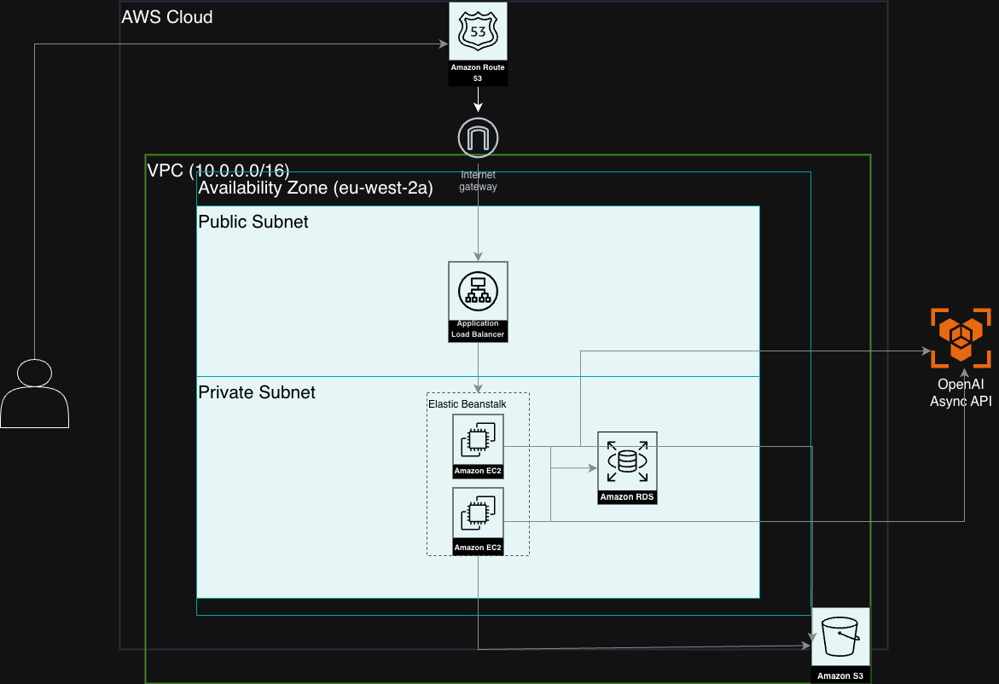

# EPL Tutors: AI-Powered EdTech Platform

This repository is a showcase of the cloud infrastructure and backend engineering behind **[epltutors.com](https://epltutors.com)**, a live, production-grade educational platform. 

To protect proprietary business logic and student data, the core application resides in a private repository. This public overview demonstrates my ability to architect, deploy, and scale secure cloud applications using AWS, Python/Django, and the OpenAI API.

## Live Demo & Guest Access
You can interact with the live production environment right now. I have provisioned a sandboxed guest account so you can test the AI grading and dynamic quiz generation.

* **URL:** [epltutors.com](https://epltutors.com)
* **Guest Username:** `employer123`
* **Guest Password:** `HireMe2026!`

---

## Cloud Architecture & Infrastructure
I architected the platform using a highly available, 3-tier AWS topology to ensure secure data handling and scalable compute for the AI integration.



### Infrastructure Highlights:
* **Network Security (VPC & Subnets):** I segmented the network to isolate the compute and data layers. The Application Load Balancer sits in a Public Subnet, whilst my Django application (EC2) and PostgreSQL database (RDS) are locked down inside a Private Subnet.
* **Compute (Elastic Beanstalk):** I utilise AWS Elastic Beanstalk to manage the WSGI/Gunicorn application servers, providing automated load balancing and auto-scaling based on web traffic.
* **Data Storage:** I route structured user state and progress data to a managed **Amazon RDS (PostgreSQL)** instance, whilst static assets and past paper PDFs are served via **Amazon S3**.
* **External APIs:** The application makes asynchronous outbound calls to the **OpenAI API** for generative marking, completely separated from the internal VPC infrastructure.

---

## Code Showcase: The AI Application Router
Below is a sanitised version of the central asynchronous Python routing logic I wrote to handle the communication between the Django backend and the OpenAI API. 

I built this specifically to handle dynamic prompt injection, enforce strict JSON validation, and auto-correct malformed LLM responses before they ever touch the database.

```python
import os
import json
import random
import logging
from typing import List, Dict, Any
from openai import AsyncOpenAI

# I import Pydantic schemas for strict data validation before database insertion
from .schemas import (
    QuizResponse, FlashcardResponse, 
    GradingResult, ExamGeneratorResponse
)

# I abstract proprietary business logic and large prompt templates into a separate module
from .brains import (
    QUIZ_SYSTEM_PROMPT, FLASHCARD_SYSTEM_PROMPT, 
    NOTES_SYSTEM_PROMPT, GRADING_BASE_PROMPT,
    EXAM_GENERATOR_PROMPT, GRADING_STRATEGIES,
    SHADOW_SYSTEM_PROMPT
)

logger = logging.getLogger(__name__)
client = AsyncOpenAI(api_key=os.getenv('OPENAI_API_KEY'))

async def generate_questions_async(notes_text: str, spec_text: str, board_name: str = "AQA") -> list:
    """
    I dynamically generate multiple-choice questions based on syllabus length.
    I ensure distractors are plausible misconceptions and shuffle the correct index safely.
    """
    content_length = len(notes_text + spec_text)
    
    if content_length < 1000:
        target_q, difficulty = 5, "Focus on key definitions and simple facts."
    elif content_length < 2500:
        target_q, difficulty = 10, "Mix of definitions and simple application."
    else:
        target_q, difficulty = 15, "Full range of difficulty including application."

    system_prompt = QUIZ_SYSTEM_PROMPT.format(board_name=board_name, target_q=target_q, difficulty=difficulty)
    user_content = f"STUDY NOTES:\n{notes_text}\n\nSPECIFICATION:\n{spec_text}"

    try:
        response = await client.chat.completions.create(
            model="gpt-4o",
            messages=[
                {"role": "system", "content": system_prompt},
                {"role": "user", "content": user_content}
            ],
            response_format={"type": "json_object"},
            temperature=0.7
        )
        
        data = json.loads(response.choices[0].message.content)
        processed_questions = []
        
        # I process and shuffle the raw AI output to ensure unpredictable correct answer positioning
        for q in data.get('questions', []):
            correct = q['correct_answer']
            distractors = q['distractors']
            
            all_options = [correct] + distractors
            random.shuffle(all_options)
            
            try:
                correct_answer_index = all_options.index(correct)
            except ValueError:
                correct_answer_index = 0
            
            processed_questions.append({
                'question_text': q['question_text'],
                'options': all_options,
                'correct_answer_index': correct_answer_index,
                'explanation': q['explanation']
            })
            
        return processed_questions

    except Exception as e:
        logger.error("Failed to generate quiz questions: %s", e)
        return []

async def generate_flashcards_async(text: str) -> List[dict]:
    """
    I generate bite-sized flashcards from raw text, strictly validated through a Pydantic model.
    """
    try:
        response = await client.chat.completions.create(
            model="gpt-4o-mini",
            messages=[
                {"role": "system", "content": FLASHCARD_SYSTEM_PROMPT},
                {"role": "user", "content": f"Content: {text}"}
            ],
            response_format={"type": "json_object"}
        )
        raw_json = json.loads(response.choices[0].message.content)
        validated = FlashcardResponse(**raw_json)
        return [f.model_dump() for f in validated.flashcards]
    except Exception as e:
        logger.error("Failed to generate flashcards: %s", e)
        return []

async def generate_notes_async(title: str, text: str) -> str:
    """
    I process raw text into structured revision notes, stripping any unwanted markdown wrappers.
    """
    try:
        response = await client.chat.completions.create(
            model="gpt-4o-mini",
            messages=[
                {"role": "system", "content": NOTES_SYSTEM_PROMPT},
                {"role": "user", "content": f"Title: {title}\nContext: {text}"}
            ]
        )
        content = response.choices[0].message.content.strip()
        
        # I strip html markdown codeblock wrappers if the LLM hallucinates them
        if content.startswith("```html"): 
            content = content[7:-3]
            
        return content
    except Exception as e:
        logger.error("Failed to generate notes: %s", e)
        return ""

async def grade_answer_async(question_type: str, question: str, answer: str, scheme: str, marks: int) -> dict:
    """
    I route the student's raw text answer to the LLM to deterministically evaluate it 
    against a strict mark scheme. It returns a structured JSON assessment payload.
    """
    strategy_text = GRADING_STRATEGIES.get(question_type, GRADING_STRATEGIES['standard'])

    user_prompt_content = f"Q: {question}\nAns: {answer}\nScheme: {scheme}\nMax Marks: {marks}\n\n{strategy_text}"
    
    try:
        response = await client.chat.completions.create(
            model="gpt-4o",
            messages=[
                {"role": "system", "content": GRADING_BASE_PROMPT},
                {"role": "user", "content": user_prompt_content}
            ],
            response_format={"type": "json_object"},
            temperature=0.0 # I enforce 0.0 temperature for deterministic grading
        )
        raw_json = json.loads(response.choices[0].message.content)
        validated = GradingResult(**raw_json)
        
        return validated.model_dump()

    except Exception as e:
        logger.error("Failed to grade answer: %s", e)
        return GradingResult(
            score=0, 
            feedback_content="Error processing grading request. Please try again.", 
            feedback_technique="", 
            mark_breakdown=[]
        ).model_dump()

async def generate_exam_questions_async(notes_text: str, spec_text: str, board_name: str = "AQA") -> list:
    """
    I generate a full assessment payload dynamically. 
    This includes custom JSON-malformation recovery logic to handle LLM edge cases.
    """
    content_len = len(notes_text + spec_text)
    
    if content_len < 1000:
        marks, etype = 12, "Mini-Assessment"
    elif content_len < 2500:
        marks, etype = 18, "Standard Test"
    else:
        marks, etype = 25, "End-of-Topic Exam"

    system_prompt = EXAM_GENERATOR_PROMPT.format(board_name=board_name, etype=etype, marks=marks)
    user_content = f"SPECIFICATION:\n{spec_text}\n\nSTUDY NOTES:\n{notes_text}"

    try:
        logger.info("Generating exam questions for board: %s", board_name)
        
        response = await client.chat.completions.create(
            model="gpt-4o",
            messages=[
                {"role": "system", "content": system_prompt}, 
                {"role": "user", "content": user_content}
            ],
            response_format={"type": "json_object"},
            temperature=0.4, 
            timeout=60.0 
        )
        
        raw_json = json.loads(response.choices[0].message.content)
        
        # I built this auto-correction block because LLMs occasionally warp JSON structures
        if "question_text" in raw_json:
            logger.warning("Malformed JSON response: missing root array wrapper. I auto-corrected it.")
            raw_json = {"questions": [raw_json]}
            
        elif isinstance(raw_json, list):
            logger.warning("Malformed JSON response: returned raw list. I auto-corrected it.")
            raw_json = {"questions": raw_json}

        elif "questions" not in raw_json:
            found_list = None
            for key, val in raw_json.items():
                if isinstance(val, list):
                    found_list = val
                    break
            
            if found_list:
                logger.warning("Malformed JSON response: unexpected root key '%s'. I auto-corrected it.", key)
                raw_json = {"questions": found_list}
            else:
                logger.error("Critical JSON structure mismatch. Found keys: %s", raw_json.keys())
                return []

        validated = ExamGeneratorResponse(**raw_json)
        return [q.model_dump() for q in validated.questions]

    except Exception as e:
        logger.error("Failed to generate exam questions: %s", e)
        return []

async def generate_shadow_question_async(source_text: str) -> dict:
    """
    I dynamically spawn a 'shadow' equivalent question to prevent students memorising past papers.
    """
    try:
        response = await client.chat.completions.create(
            model="gpt-4o",
            messages=[
                {"role": "system", "content": SHADOW_SYSTEM_PROMPT},
                {"role": "user", "content": source_text}
            ],
            response_format={"type": "json_object"},
            temperature=0.7 
        )
        return json.loads(response.choices[0].message.content)
    except Exception as e:
        logger.error("Failed to generate shadow question: %s", e)
        return {}
