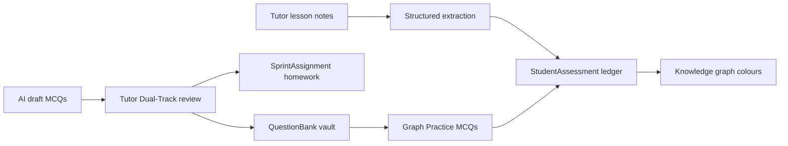

# EPL Tutors — architecture case study

A production learning platform I designed, built, and operate for my own GCSE and A-level science students. Product source stays private. This is the public technical story.

**Live product:** [epltutors.com](https://epltutors.com)

## The problem

Small-group tutoring produces a lot of signal that usually dies in a notebook: what was taught, what landed, what should be practised, and whether last month’s “they’ve got this” is still true. Parents want a weekly picture. The tutor needs a queue, not another spreadsheet.

I modelled that as a **syllabus knowledge graph** plus two separate write paths: homework compliance, and mastery.

## What’s public

- The tutoring site itself — [epltutors.com](https://epltutors.com)
- This write-up — schema and trade-offs, no source
- A synthetic **student** login, on request (see [Demo](#demo))

## Data model

```
Student ──< StudentAssessment >── Competency
   │                │                  │
   │                └── LessonLog      └── Prerequisite (edge)
   │
   ├── QuizAttempt          (objective % scores)
   ├── SprintAssignment     (homework; does not recolour the graph)
   └── QuestionBank         (tutor-approved MCQ vault)
```

**Competency** is one syllabus outcome (for example `1.2 Kinetic & GPE`) with exam-board tags (Combined / Triple / IGCSE, plus Edexcel- and Cambridge-only nodes). **Prerequisite** edges are the graph.

**StudentAssessment** is an append-only ledger. Latest row per `(student, competency)` is the mastery snapshot. `next_review_date` comes from a shared 1–5 → days table (1 day through 30 days). Older rows stay so a weekly digest can say improving vs slipping.

**Homework does not paint the map.** Sprint scores are compliance. Only Graph Practice (vault MCQs) writes mastery. That stops a lucky homework set from turning a topic green.

**Programme is an assignment, not a UI toggle.** GCSE Combined / Triple / exam board live on the student row so a shared laptop cannot flip another child’s map.

## Write paths

Homework and mastery are different writers. Lesson notes and Graph Practice update the ledger (and therefore the heatmap). A sprint score does not.


```mermaid
flowchart LR
  lessonNotes["Tutor lesson notes"] --> worker["Structured extraction"]
  worker --> ledger["StudentAssessment ledger"]
  graphPractice["Graph Practice MCQs"] --> ledger
  ledger --> heatmap["Knowledge graph colours"]
  draftMcqs["AI draft MCQs"] --> review["Tutor Dual-Track review"]
  review --> homework["SprintAssignment homework"]
  review --> vault["QuestionBank vault"]
  vault --> graphPractice
```

## AI, with a human in the loop

- Tutor pastes lesson notes → a background job extracts topics and **evidence quotes** into the ledger (`gpt-4o-mini`, structured outputs).
- Draft MCQs go to a Dual-Track queue: assign as homework, send to the vault, or reject.
- The vault is the only source for Graph Practice. Unreviewed model output never colours mastery.

Generation is cheap. Publication is the control.

## Stack I actually run

- API: FastAPI, SQLAlchemy 2, Pydantic v2, Alembic, JWT + bcrypt
- DB: PostgreSQL (Neon) — pooler for the API, direct host for migrations
- Frontend: Next.js on Vercel at epltutors.com
- API host: Docker on AWS EC2, Nginx, Let’s Encrypt (`api.epltutors.com`)
- Tests: 100+ pytest cases on in-memory SQLite (product flows, boards, reports)

This is a single-operator tool with a real domain model, not a multi-tenant SaaS. Tutor-scoped roster isolation is the next gate if other centres ever use it.

## Related public work

The interesting part is the graph, the ledger, the board maps, and the review loop — not the React shell. Complementary modelling work:

- [mistral-finetune-pipeline](https://github.com/Salama-Khan/mistral-finetune-pipeline)
- [expectedthreatmodel](https://github.com/Salama-Khan/expectedthreatmodel)

This platform is where a data model has to survive contact with real lessons.

## Design decisions I would walk through

- Why homework and mastery are different writers.
- Why assessments are append-only and ordered by `created_at`, not `next_review_date`.
- Why a tutor session on the live database is unsafe (those APIs can see every student, including minors), and how I would add `tutor_id` filters before selling this to other centres.

## Demo

I can send a synthetic student login so you can use the graph, a homework sprint, and the weekly report. It is a fake learner (Alex Demo), not a real child.

I do not share a tutor account on production, and I do not publish a password in this repo.

Ask via [LinkedIn](https://www.linkedin.com/in/salama-khan) or [GitHub](https://github.com/Salama-Khan).
